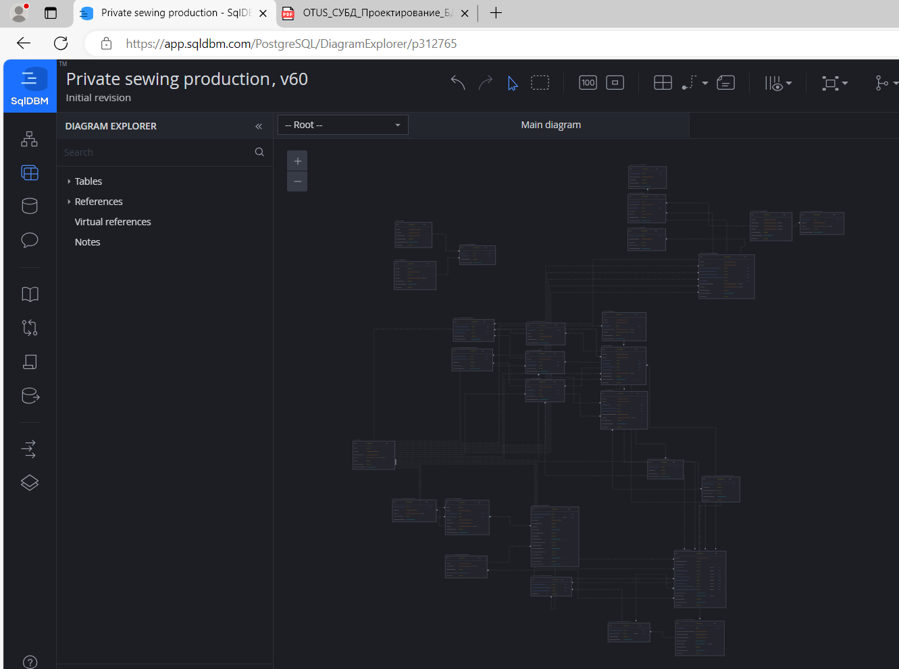
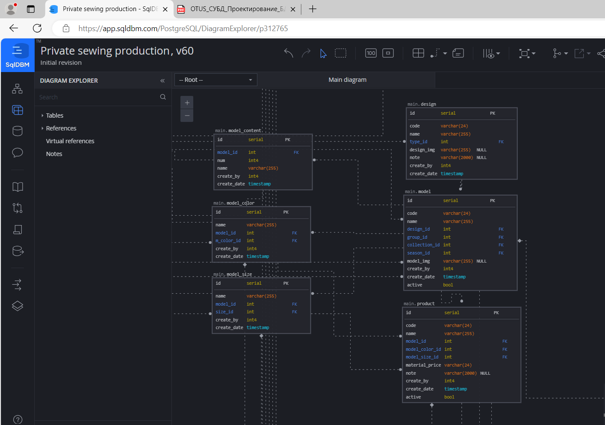

## Домашнее задание к занятию "1. Проектирование БД"

### Разработка проекта БД

Проектирование выполняла в сервисе sqldbm.com

Не нашла в бесплатной версии сервиса возможность выгрузить или экспортировать схему.
Поэтому, сгенерировала в нем SQL-запросы для создания таблиц и создала БД в PostgreSQL.

Создала ER-диаграмму (схему БД) в DBeaver
[Sewing_prod.erd](Sewing_prod.erd)

Бэкап БД прилагаю
[dump-sewing_prod](dump-sewing_prod-202409272115.sql)

==================================================
### Описание БД

БД "Частное швейное производство"

БД создана для автоматизации небольшого швейного производства домашнего типа.
Основной производимый продукт - детская одежда.
Планируется изготавливать изделия и продавать готовую продукцию, а также производить небольшой сегмент изделий на заказ по имеющимся моделям.

Цели:

* планирование закупки материалов
* расчет себестоимости изделий
* контроль и анализ сбыта

#### Описание БД.

БД разделена на 4 схемы:

* warehouse - склад материалов:
используется для учета расходных материалов (основное-ткань, дополнительно-различная фурнитура и т п), информации о поставщиках

* main - производственная часть:
хранится информация о выкройках, моделях, изготавливаемых изделиях, вариантах исполнения (цвет, размер), расчет расхода тканей и фурнитуры на каждое изделие

* prod_warehouse - склад готовой продукции:
учет наличия готовой продукции

* selling - этап продаж:
информация о площадках продаж, частных заказчиках, расчет себестоимости, конечной стоимости изделия, система скидок по различным критериям (модель, цвет, размер, коллекция и т п), оформление заказа

Термины:

* design - выкройка (например, выкройка толстовки)
* model - модель (например, толстовка T_01 Новогодняя коллекция 2024-25)
* product - изделие (например, толстовка T_01 Новогодняя коллекция 2024-25 зеленого цвета 92 размера)

