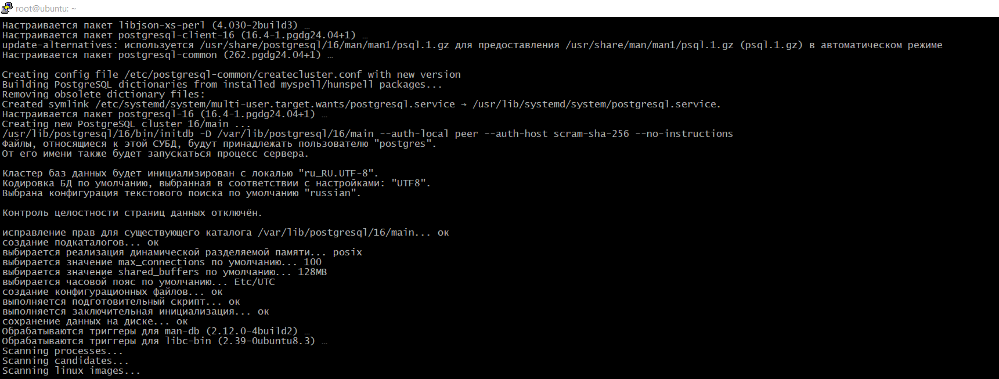
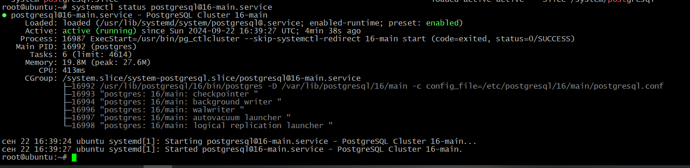
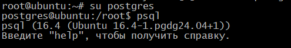
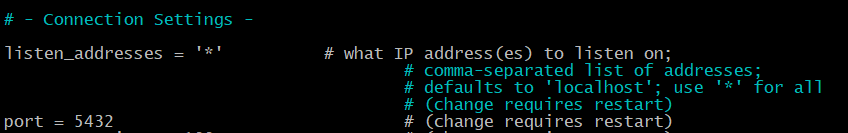
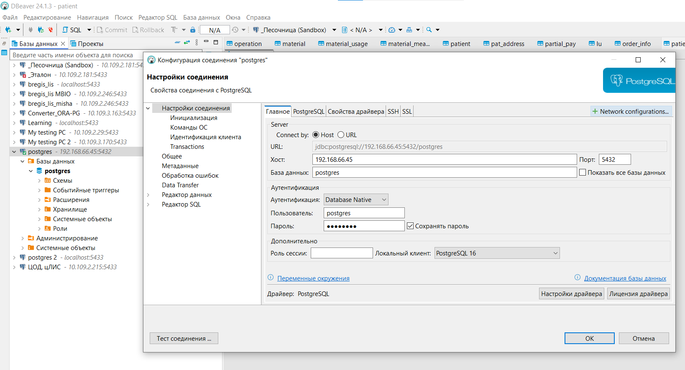

## Домашнее задание к занятию "6. Внутренняя архитектура СУБД PostgreSQL"

1. Развернуть контейнер с PostgreSQL или установить СУБД на виртуальную машину.

```commandline
sudo apt update
sudo apt upgrade
sudo apt install dirmngr ca-certificates software-properties-common apt-transport-https lsb-release curl -y
curl -fSsL https://www.postgresql.org/media/keys/ACCC4CF8.asc | gpg --dearmor | sudo tee /usr/share/keyrings/postgresql.gpg > /dev/null
echo deb [arch=amd64,arm64,ppc64el signed-by=/usr/share/keyrings/postgresql.gpg] http://apt.postgresql.org/pub/repos/apt/ $(lsb_release -cs)-pgdg main | sudo tee /etc/apt/sources.list.d/postgresql.list
sudo apt update
sudo apt install postgresql-client-16 postgresql-16
```


2. Запустить сервер.

```commandline
 systemctl status postgresql@16-main.service
```


3. Создать клиента с подключением к базе данных postgres через командную строку.

Подключаюсь ранее установленным клиентом.



4. Подключиться к серверу используя pgAdmin или другое аналогичное приложение.

Редактирую конфиги Postgres (pg_hba.conf, postgresql.conf) для возможности внешних подключений.




Подключаюсь к Postgres DBeaver.


